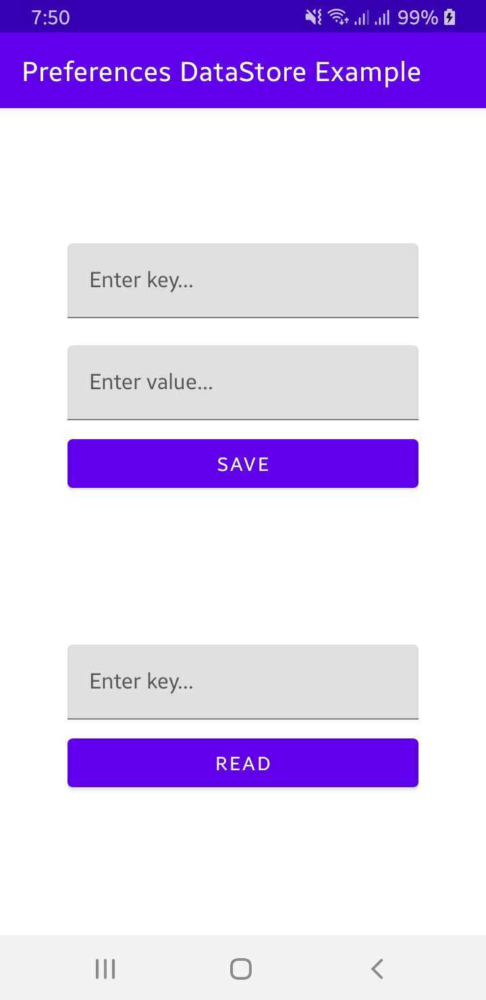

#Preferences DataStore Demo App

 

   

 

## Built With 🛠
- [Kotlin](https://kotlinlang.org/) - Official programming language for Android development.
- [Prefrences DataStore] - https://developer.android.com/topic/libraries/architecture/datastore#kts
- [DataBinding](https://developer.android.com/topic/libraries/data-binding) - Support library that allows to bind UI components.
- [Coroutines](https://developer.android.com/kotlin/coroutines) - A coroutine is a concurrency design pattern that you can use on Android to simplify code that executes asynchronously.

